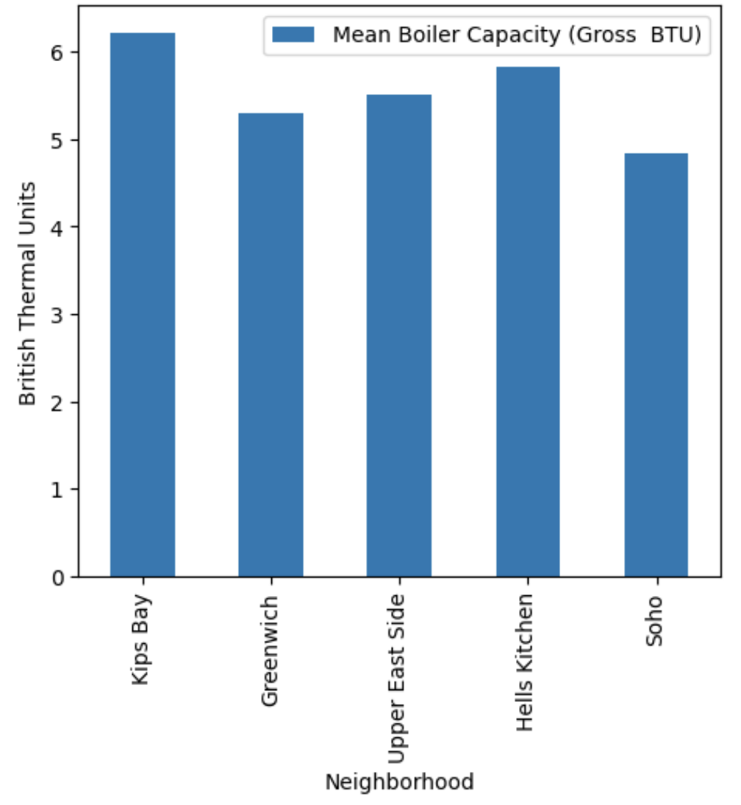

# The Upper East Side
## Highlighted Map

## Demographics
**The Upper East Side consists of 5 main ZIP code areas.**

**10128:**

Total population of 58,147 residents ⇒ 68.21% White, 12.97% Hispanic, 9.79% Asian, and 4.94% Black. 0% school drop-out rate and 78.48% of the population 25 and over have a bachelor's degree or higher. Median household income is $127,919 with 32.97% of household income being over $200k. Unemployment rate is 4.96%. 35,628 total housing units.

**10065:** 

Total population of 31,270 residents ⇒ 73.69% White, 13.76% Asian, 8.23% Hispanic, and 1.94% Black. 4.35% school drop-out rate and 85.36% of the population 25 and over have a bachelor's degree or higher. Median household income is $133,825 with 39.37% of household income being over $200k. Unemployment rate is 2.43%. 22,304 total housing units. 

**10021:**

Total population of 42,484 residents ⇒ 82.35% White, 9.16% Asian, 5.74% Hispanic, and 0.3% Black. 0% school drop-out rate and 78.77% of the population 25 and over have a bachelor's degree or higher. Median household income is $120,640 with 34.39% of household income being over $200k. Unemployment rate is 4.48%. 30,022 total housing units. 

**10028:**

Total population of 47,793 residents ⇒ 81.81% White, 7.56% Hispanic, 7.31% Asian, and 0.99% Black. 0% school drop-out rate and 81.52% of the population 25 and over have a bachelor's degree or higher. Median household income is $149,789 with 38.07% of household income being over $200k. Unemployment rate is 4.05%. 29,860 total housing units. 

**10075:**

Total population of 23,391 residents ⇒ 79.57% White, 8.01% Hispanic, 7.09% Asian, and 1.81% Black. 0% school drop-out rate and 81.9% of the population 25 and over have a bachelor's degree or higher. Median household income is $131,372 with 32.59% of household income being over $200k. Unemployment rate is 2.67%. 14,542 total housing units.

## HC3
New York City has implemented several environmental programs, including the NYC Clean Heat Program, DEP Boiler Registration, and the Greener Greater Buildings plan, to reduce the negative environmental impacts of using heavy fuels like No. 4 and No. 6. These fuels, known for their harmful effects on the environment and their contribution to public health concerns, prompted the establishment of the Clean Heat Program in 2012, an initiative aimed to improve air quality and reduce greenhouse gas emissions by encouraging buildings to transition to cleaner fuels like natural gas and other renewable options. Another program, the DEP Boiler Registration, monitors boiler emissions to reduce pollution. The Greener Greater Buildings plan focuses on enhancing energy efficiency in large buildings, with laws requiring owners to report consumption data and implement energy-saving measures. The International Energy Agency emphasizes the importance of electrification and bioenergy in reducing emissions by 2050. The Environmental Protection Agency emphasizes renewable natural gases as more sustainable sources for cleaner heating. The transition to cleaner heating fuels faces challenges, but policy implementation along with fiscal incentives can support the transition. 

## HC4 
Greenhouse gas emissions in New York City primarily result from burning fossil fuels for electricity. The reliance on aging natural gas power plants contributes to greenhouse gas emissions and air pollutants that imapct the city's air quality and contribute to public health concerns. Buildings are the largest source of greenhouse gas emissions in the city. Particularly, large buildings constructed in the 1950s are major contributors to these emissions. Consequently, NYC City Council passed Local Law 97 in 2019, targeting an 80% reduction in greenhouse gas emissions by 2050, with a focus on large buildings. Manhattan, due to its numerous large buildings, is the borough with the highest emissions in the city. Furthermore, energy inefficient appliances further contribute to the city's electricity consumption. Consequently, new legislation starting in 2026 will ban the use of fossil fuels in most new buildings of seven stories or less. Overall, New York City is committed to its efforts to control greenhouse gas emissions and combat climate change.

## HC 7 & 8 

Kips Bay has the highes Boiler Capacity (Gross BTU) followed by Hell's Kitchen, the Upper East Side, Greenwich, and finally, Soho. 

.png)
Hell's Kitchen has the highest Mean Total Gallons (High) followed by the Upper East Side, Kips Bay, Greenwich, and finally, Soho. 

.png)
Hell's Kitchen also has the highest Mean Total Gallons (Low) followed by the Upper East Side, Kips Bay, Greenwich, and finally, Soho.

.png)
Kips Bay has the 

.png)

## Interactive Map
<iframe src="UpperEastLocations.html" width="600" height="400" frameborder="0" frameborder="0" marginwidth="0" marginheight="0" allowfullscreen></iframe>
